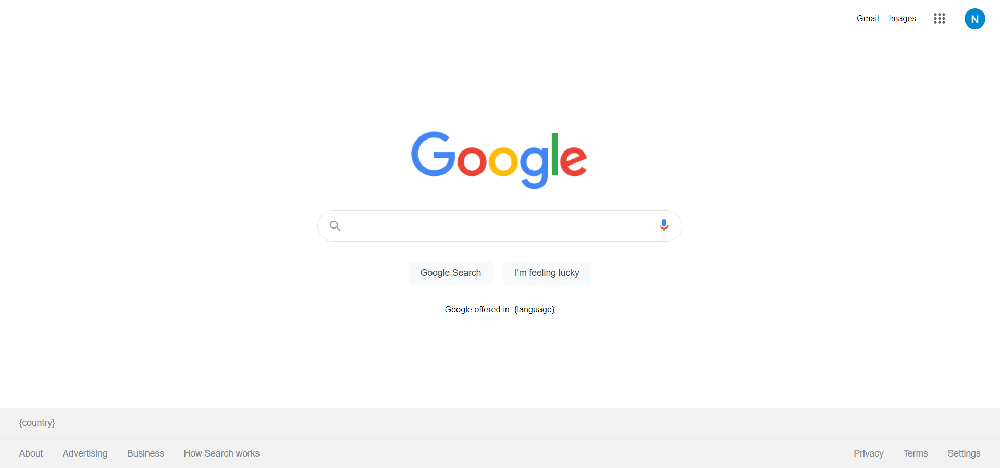

# Google clone
Created in HTML5, SASS with BEM metodology and JavaScript. Project is bundled by webpack which is configured to transpile sass into css, minify all files and transpile JavaScript ES6+ into ES5. Finally deployed on gh-pages branch with the usage of yarn script.  
[View Demo](https://nilphym.github.io/Google-clone)

## Table of content
* [General info](#general-info)
* [Screenshots](#screenshots)
* [Technologies](#technologies)
* [Setup](#setup)
* [Contact](#contact)

## General info
The project is based on [the original google website](https://www.google.com).  
On github project is tested by Github Actions CI/CD tool if throws any linter's warnings or fails jest's tests.  
Website is still under development. Final product will contain responsive version of site, checking country by ip, search history using localStorage, two languages - Polish and English and Google app tiles.

## Screenshots

## Technologies
* [HTML5](https://html.spec.whatwg.org)
* [SASS](https://sass-lang.com)
* [JavaScript](https://developer.mozilla.org/en-US/docs/Web/JavaScript)
* [Webpack bundler](https://webpack.js.org)
* [Github Actions CI/CD Tool](https://github.com/features/actions)
* [Yarn package manager](https://yarnpkg.com)
* [Jest](https://jestjs.io)
* [ESLint](https://eslint.org)
* [StyleLint](https://stylelint.io)

## Setup
To view the website simply [click here](https://nilphym.github.io/Google-clone).

## Contact
Created by **Jędrzej Ratajczak** ([@nilphym](https://github.com/nilphym)) - feel free to contact me!